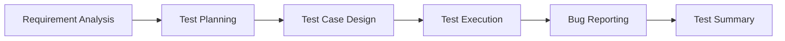

<h1 align="center">
  📘 EDGE Intermediate SQA Training Assignments
</h1>

<p align="center">
  
</p>

<p align="center">
  
  
  
  
</p>

---

# 🎯 About This Repository

This repository contains all assignments, practice tasks, and project work completed during the:

## 🏛 Enhancing Digital Government & Economy (EDGE)
### Intermediate Software Quality Assurance (SQA) Training Program

The purpose of this repository is to document learning progress, practical testing knowledge, and hands-on experience in Software Quality Assurance.

---

# 📚 Topics Covered

✅ Software Testing Fundamentals  
✅ SDLC & STLC  
✅ Test Case Writing  
✅ Bug Reporting  
✅ Manual Testing  
✅ API Testing  
✅ Automation Testing  
✅ Selenium Basics  
✅ Performance Testing  
✅ Database Testing  
✅ Agile Testing Concepts  

---

# 🗂 Repository Structure

```text id="6n1hqp"
Edge-software-testing/
│
├── Assignment-01/
├── Assignment-02/
├── Assignment-03/
├── Manual-Testing/
├── Automation-Testing/
├── Bug-Reports/
├── Test-Cases/
└── Documentation/
````

---

# 🚀 Learning Objectives

This training repository helps to practice:

* Real-world software testing techniques
* Professional QA documentation
* Test planning & execution
* Automation testing basics
* Industry-standard QA workflows

---

# 🛠 Tools & Technologies

<p align="center">
  
</p>

| Tool            | Purpose                 |
| --------------- | ----------------------- |
| Selenium        | Automation Testing      |
| Postman         | API Testing             |
| Git & GitHub    | Version Control         |
| VS Code         | Development Environment |
| JIRA            | Bug Tracking            |
| Chrome DevTools | Web Testing             |

---

# 📖 Assignment Workflow



---

# 🌟 Highlights

🔥 Hands-on SQA Practice
📘 Organized Assignment Collection
🧪 Manual & Automation Testing
📊 QA Documentation Practice
🚀 Continuous Learning Journey

---

# 🤝 Contribution

This repository is mainly for learning and practice purposes.
Suggestions and improvements are always welcome.

---

# 📌 Program Information

🎓 Program: EDGE Intermediate SQA Training
🏛 Initiative: Enhancing Digital Government & Economy (EDGE)
💻 Focus Area: Software Quality Assurance

---

# 📜 License

This repository is for educational and learning purposes.

---

<p align="center">
  💙 Learning Software Testing Step by Step
</p>

<p align="center">
  
</p>

